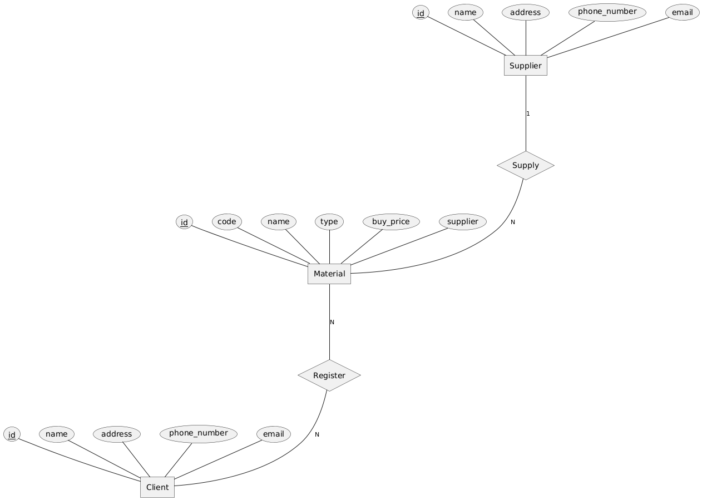
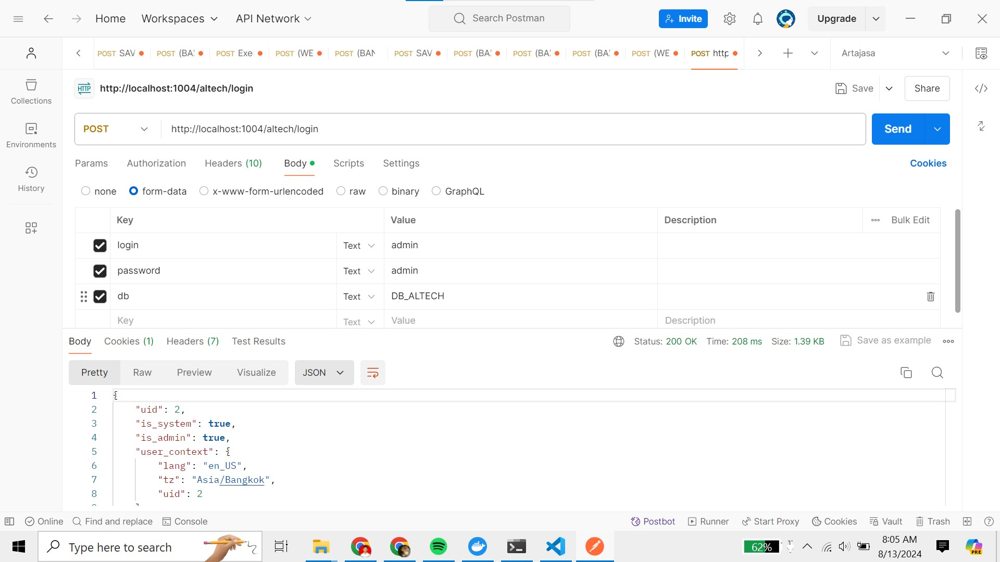
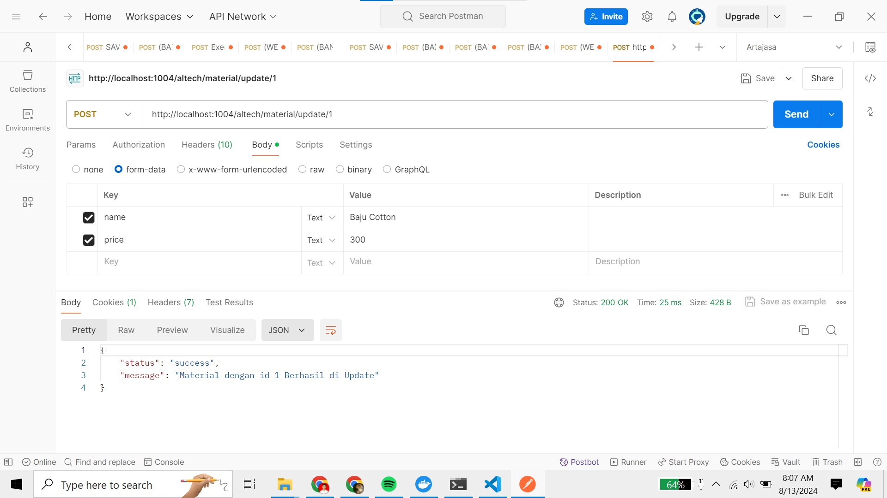
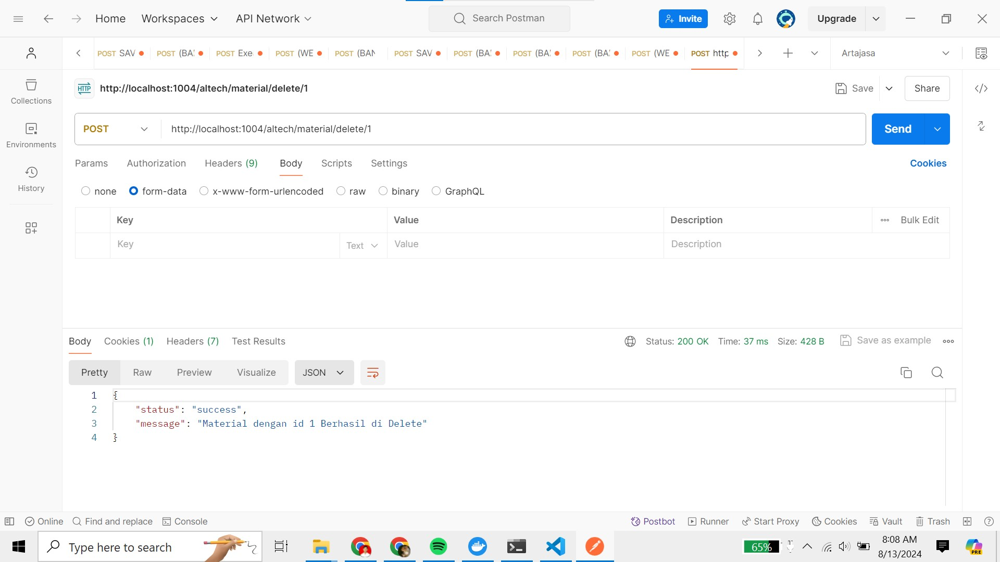

# BACKEND ODOO TEST

Kebutuhan client adalah membuat sebuah modul Odoo 14 yang didalamnya berfungsi
untuk melakukan registrasi material yang akan dijual. Informasi yang harus dibutuhkan
client adalah:

1. Material Code
2. Material Name
3. Material Type (dropdown 3 pilihan: Fabric, Jeans, Cotton)
4. Material Buy Price
5. Related Supplier (dropdown : Nama supplier)

Seluruh informasi tersebut harus terisi, dan untuk material buy price tidak boleh nilainya
< 100.

Selain itu client juga harus dapat:

1. Melihat seluruh materials yang telah dibuat, Client juga harus dapat memfilter
   berdasarkan Material Type
2. Melakukan update terhadap satu material
3. Melakukan delete terhadap satu material

## PETUNJUK PENGGUNAAN ADDONS

1. Copy folder "altech" lalu paste ke folder addons odoo
2. Update list app odoo
3. Install module dengan nama "altech"

## ERD

Pada gambar diatas dijelaskan bahwa ERD yang dibuat developer memiliki 3 entitas yaitu Supplier, Material dan Client. Entitas Supplier dan Client akan di develop menggunakan model dari Odoo yaitu res.partner dan res.user, sedangkan untuk entitas Material akan di develop secara custom. Setiap entitas menggunakan id sebagai Primary Key nya.

 
Relationship antara entitas Supplier dan Material adalah One-to-Many sehingga setiap material hanya memiliki 1 supplier saja. Sedangkan untuk entitas Material dan Client memiliki relationship Many-to-Many sehingga client bisa meregistrasikan banyak material dan material bisa diregistrasikan oleh banyak client.

 
ERD yang dibuat oleh developer, disesuaikan dengan struktur database dari Odoo

 

## Unit Testing (Black Box Testing)

<table>
    <tr>
        <th>Description</th>
        <th>Input</th>
        <th>Expected Output</th>
    </tr>
    <tr>
        <td>Valid Material Registration</td>
        <td>Isi semua field saat menambahkan material</td>
        <td>Material berhasil diregistrasi</td>
    </tr>
    <tr>
        <td>Missing Attribute Value</td>
        <td>Saat menambahkan material, kosongkan salah satu field, lalu save</td>
        <td>Error Missing Value</td>
    </tr>
    <tr>
        <td>Material Buy Price less than 100</td>
        <td>Saat menambahkan material, isi field Buy Price menjadi kurang dari 100</td>
        <td>Validation Error</td>
    </tr>
    <tr>
        <td>Filter materials by valid type</td>
        <td>Klik tombol "filter" dibawah kolom search. Lalu pilih salah satu tipe material</td>
        <td>Muncul daftar material sesuai dengan tipe material yang di filter</td>
    </tr>
</table>

Untuk testing update API dan delete API yang sudah dibuat di controller, bisa mengikuti langkah - langkah ini.

<ol>
  <li>Akses sistem dengan cara melakukan request ke API login dengan path <strong>/altech/login</strong> lalu masukkan attribute seperti pada contoh dibawah.</li>
  
  <li>Lalu untuk melakukan update, lakukan request ke path <strong>/altech/material/update/(id material)</strong> lalu masukkan attribute seperti pada contoh dibawah.</li>
   
  <li>Untuk melakukan delete, lakukan request ke path <strong>/altech/material/delete/(id material)</strong> seperti pada contoh dibawah.</li>
   
</ol>
